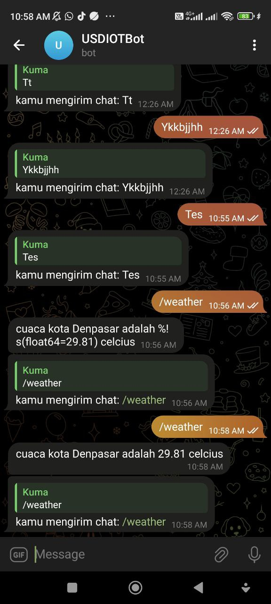

# About

apliaksi bot telegam yang dibangun menggunakan bahasa golang

## fitur

1. reply message
2. mengirim cuaca disebuah kota menggunakan api openweather(masih untuk kota denpasar saja)
3. coming soon

## running on podman

```Docker
podman run -d -it \
  --env BOT_TOKEN=6161682384:AAEIXnArofKtYvW8AKkAZp5OnrF8OxiuBSc \
  --env OPENWEATHER_API_KEY=28ea9963ad1cc250642c93f252e9cd22 \
  --name telegram-go-v1 telegram-go:scratch
```

### capture


